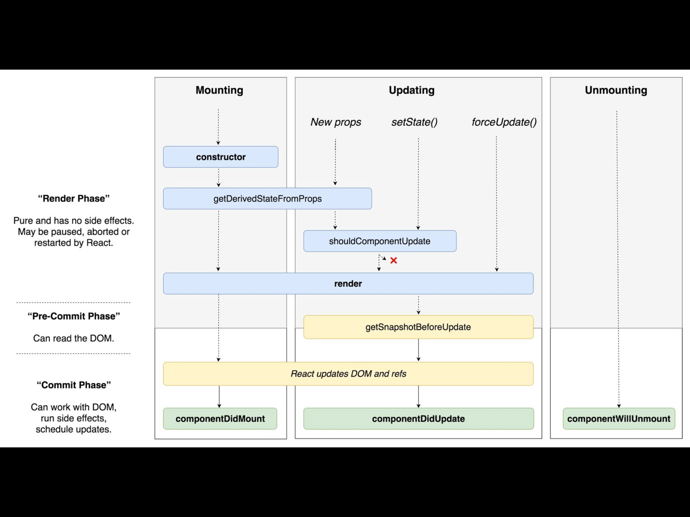
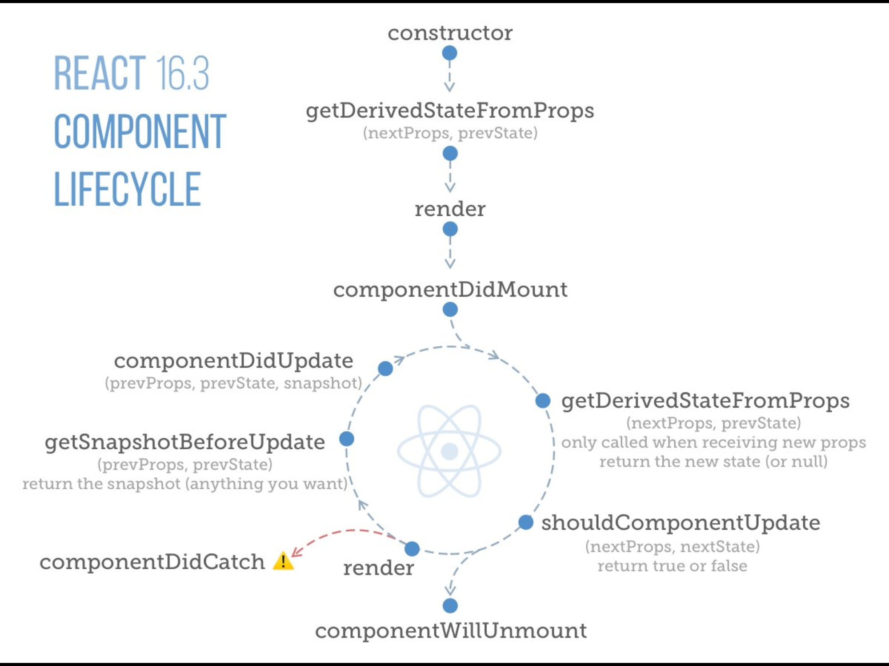

## React JS Components

### ==1._document.j==

- /pages/_document.js에 생성
- 기본 document클래스를 확장하는 커스텀 클래스 형태로 제작
- 웹사이트 전체를 감싸는 템플릿 역할 수행
- <head>태그 내에 필요한 내용을 선언할 수 있음
- Head, Main, NextScript 컴포넌트를 반드시 포함해야 함

```
import Document, {Head, Main, NextScript} from 'next/document';

class CustomDocument extends Document {
	render() {
		return (
			<html>
				<Head>
					<title>Bootstrap Demo</title>
					<link rel="stylesheet" href="https://stackpath.bootstrapcdn.com/bootstrap/4.1.3/css/bootstrap.min.css" integrity="sha384-MCw98/SFnGE8fJT3GXwEOngsV7Zt27NXFoaoApmYm81iuXoPkFOJwJ8ERdknLPMO" crossOrigin="anonymous"/>
         		</Head>
         		<body>
             		<div className="container">
                 	<Main/>
             		</div>
            			<NextScript/>
         		</body>
     		</html>
    	);
  	}
}

export default CustomDocument;
```


#### ==1.1 Head tag==

- _document를 생성할 때 가장 유용하게 사용되는 기본 컴포넌트
- _document안에서 선언시에 'next/document'패키지 사용 시 아래와 같이 선언 <br/>
```
import{ Head } from 'next/document';
```

- 다른 페이지에서 사용할때 'next/head'패키지 사용 아래와 같이 선언<br />
```
import Head from 'next/head'
```
- _document 에서 선언되면, 각 페이지에서 부분 재정의되어 사용 가능


##### 1.1.1.Head 기본 구조

```
import Document, {Head, Main, NextScript} from 'next/document';

class CustomDocument extends Document {
	render() {
		return (
			<html>
				<Head>
				</Head>
         		<body>
             		<Main/>
             		<NextScript/>
        		</body>
     </html>
    );
  }
}
```

##### 1.1.2 Head에서 재정의하는 방법

```
//Home.js

import Head from 'next/head';

class Home extends Component {
	render() {
		return (
			<div>
				<Head><title>페이지제목</title></Head>
				...
			</div>
		);
	}
}

```
##### Head에서 재정의 하는 것들

- SEO를 위한 title, meta 태그
- open graph 태그
- 특정 페이지에서만 필요한 스크립트/스타일시트 (결제 페이지에서 결제시스템 로드 시키는 기능 등)


#### ==2 React Life Cycle==

- 리액트의 생명 주기 (리액트가 어떻게 작동되는지 사이클로 보기) 를 작동시키기 위해 =='getInitialPros'== 선언하여 작동하게 하자

- 처음 생성되어 메모리에 올라가고 --> 화면에 표시되고--> 표시가 제거된 후 --> 메모리에서 사라짐 <br /> 
이러한 일련의 과정을 거침 (화면에 나오는 모든 요소들은 라이프 사이클을 가지고 있음)
- 라이프 사이클 중간중간의 특정 이벤트를 넣어 활용할 수 있음 (어떤 상황에서 추가적인 이벤트를 할 수 있는가를 알 수 있음)

mounting(화면에서 나타나는 시점) -> updating ->unmounting(화면에서 사라지는 시점)





##### React 주요 이벤트

- constructor : 객체가 생성되는 순간
- componentdidMount: 요소가 화면에 표시된 직후
- shouldComponentUpdate: 업데이트 할 요소가 있을 때 (렌더하기 직전)
- componentWillUnmount : 화면에서 제거되기 직전


#### ==2.1 getInitialProps==

- next.js에만 있는 라이프 사이클
- pages 디렉토리 하위의 클래스에서만 사용 가능
- 백엔드에서 동작하는 이벤트
- 이 시점에서 api등을 이용해 데이터를 가져오면 서버사이드 랜더링 결과에 반영 가능
- static으로 선언하고, async 함수로 선언해야 함
- 이 함수가 return 하는 오브젝트가 this.props가 됨

```
 class Custom extends Component {
 	static async getInitialProps({ req }) {
 		let userAgent = ' ';
 		
 		//http request가 존재하는지 여부 체크
 		if ( req ) { 
 			userAgent = req.headers['user-agent'];
 		}
 		else {
 			userAgent = navigator.userAgent;
 		}
 		return {userAgent}
 	}
 	render(){
 		return <div>Hello, { this.props.userAgent }</div>
 	}
 }
```

#### ==2.2 Custom Component==

- 반복적으로 사용되는 요소를 컴포넌트로 만들어서 분리
- 코드 간결화, 높은 재사용성, 수정 용이
- props 활용: 부모 요소가 자식 요소에게 넘겨주는 데이터임


#### ==2.2.1 Props==
- HTML의 attribute와 같은 형태
- 문자열로 전달할 수도 있고, 데이터로 전달 할 수도 있음
- 문자열 전달 시 " " 사용
- 데이터 전달 시 ({ }) 사용

i.e) 

```
//props 없이 쓰일때
<ProfileImage/>


//size라는 props로 "100" 전달
<ProfileImage size="100"/>


//숫자로 넘기고 싶다면 { }사용
<ProfileImage size={ 100 }/>


<ProfileImage url ="..."/>
<ProfileImage url ={"..."}/>


```

#### ==2.2.1 Component 만들기==

```
class ProfileImage extends Component {
	state= {}
	constructor( props ) {
		super(props);
		this.state.width = this.state.height = props.size || 200;
		this.state.url = props.url || 'http://placeimg.com/200/200/animals';
		}
	render(){
		const style = {
			width: this.state.width,
			height: this.state.height,
			backgroundImage: 'url($(this.state.url})',
		}
		return (
			<span style={ stytle } />
		);
	}
}
```

#### ==2.2.3 만들어진 Component 사용하기==

```
import ProfileImage from '../components/ProfileImage';

class Page extends Component{
 render(){
 	return(
 		<div>
 			<ProfileImage/>
 			<ProfileImage size={ 150 }/>
 			<ProfileImage size={ 100 }/>
 			<ProfileImage url={ "https://placeimg.com/300/300/animals" }/>
 			<ProfileImage url={ "https://placeimg.com/400/400/animals" }/>
 			<ProfileImage url={ "https://placeimg.com/500/500/animals" }/>
 		</div>
 	);
 }
}
```


